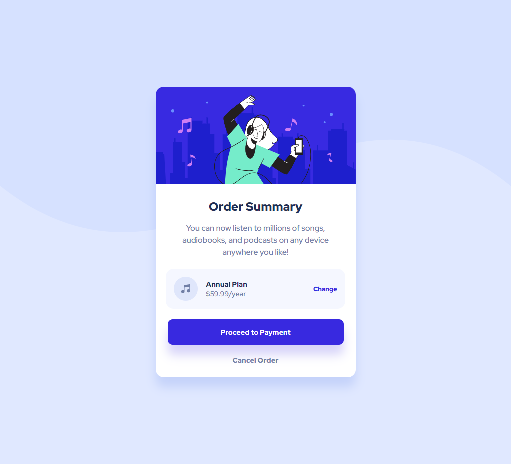

# Frontend Mentor - Order summary card solution

This is a solution to the [Order summary card challenge on Frontend Mentor](https://www.frontendmentor.io/challenges/order-summary-component-QlPmajDUj). Frontend Mentor challenges help you improve your coding skills by building realistic projects. 

## Table of contents

- [Overview](#overview)
  - [The challenge](#the-challenge)
  - [Screenshot](#screenshot)
  - [Links](#links)
- [My process](#my-process)
  - [Built with](#built-with)
  - [What I learned](#what-i-learned)
  - [Continued development](#continued-development)
  - [Useful resources](#useful-resources)
- [Author](#author)

## Overview

### The challenge

Users should be able to:

- See hover states for interactive elements

### Screenshot

### Links

- [Frontend Mentor: Solution URL](https://www.frontendmentor.io/solutions/order-summary-component-using-react-khKnWJjFo)
- [Vercel: Live Site URL](https://order-summary-component-dun.vercel.app/)

## My process

### Built with

- Semantic HTML5 markup
- CSS custom properties
- Flexbox
- CSS Grid
- Mobile-first workflow
- [React](https://reactjs.org/) - JS library

### What I learned

The order summary component was surprisingly more difficult than the other two card components. For this challenge, I had to scrap everything and restart a few times because I was having bugs with child divs floating outside the parent div and issues with children resizing with their parents. I had to seriously take time to understand the css box-model, css grid, and css flexbox to complete this challenge. I also took the time to understand the units in CSS and when to use each one. This challenge was a good change of pace and showed me how much I didn't understand about vanilla CSS.

### Continued development

I think after this challenge, I want to move on to much larger layouts with many different components. I've started to imagine boxes around each element and understood when and where to add margin or padding. I think I need more practice with Flexbox and CSS Grid with larger layouts, but I'm starting to build these projects quicker with a better understanding of how to position everything. I really need to clean up my css code though. I feel like it gets messier as I continue to tweak everything to match the design.

### Useful resources

- [Fireship: 10 CSS Pro Tips - Code this, NOT that!](https://www.youtube.com/watch?v=Qhaz36TZG5Y) - CSS code writing practices using modern features
- [Web Dev Simplified: Learn CSS Box Model in 8 minutes](https://www.youtube.com/watch?v=rIO5326FgPE) - CSS Box Model overview

## Author
Ian Wu

- Frontend Mentor - [@iannnop](https://www.frontendmentor.io/profile/iannnop)
- LinkedIn - [@iannnop](https://www.linkedin.com/in/iannnop/)
- Twitter - [@iannnop](https://www.twitter.com/iannnop)
